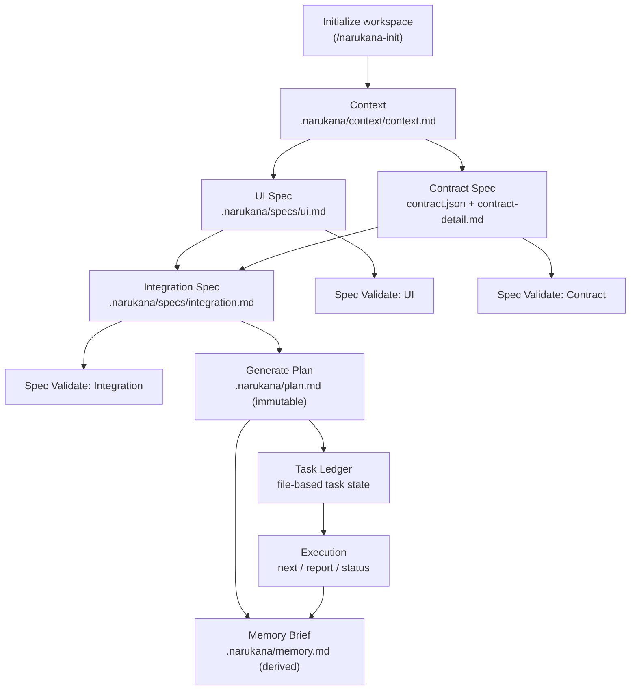

<p align="center">
  
</p>

<p align="center">
  
  
  
</p>

<p align="center">
  
</p>

# Narukana

Narukana is a spec engine for AI-assisted development. It keeps work aligned by making specs the source of truth, generating an immutable plan from those specs, and coordinating execution through a shared task ledger.

Works with any agent (OpenCode, Claude Code, Cursor, etc.) — no plugins, no runtime dependencies, no build step, no vendor lock-in.

## What Narukana does

- Creates and manages a `.narukana/` workspace with OpenCode skills (15 skills in `skills/`).
- Treats `.narukana/context/*` and `.narukana/specs/*` as editable source of truth.
- Generates `.narukana/plan.md` as a derived, immutable artifact.
- Generates `.narukana/memory.md` as a derived brief for fresh agent sessions.
- Provides validators for spec quality and implementation evidence.
- Supports parallel multi-agent execution through shared task state.

## Spec Engine Workflow



## Quick Start

### Step 1: Clone the repository

```bash
git clone https://github.com/Rezacrown/Narukana
cd Narukana
```

### Step 2: Install skills (OpenCode)

```powershell
cp -r skills $env:USERPROFILE\.config\opencode\skills\narukana-skills
```

### Step 3: Install command wrappers (OpenCode)

```powershell
cp command/*.md $env:USERPROFILE\.config\opencode\command\
```

### Step 4: Restart OpenCode

Close and reopen your OpenCode terminal. Verify with:

```
/narukana-init
```

The `narukana-init` skill loads and guides you through initialization.

**No build step, no dependencies, no config changes needed.**

---

## Installation for other AI agents

Narukana works with any AI agent. The skills follow the [Agent Skills](https://agentskills.io) open standard, which means they are portable across tools that support it.

### Claude Code

Skills in `~/.claude/skills/` are auto-discovered by Claude Code and available as slash commands.

```bash
# Clone the repo
git clone https://github.com/Rezacrown/Narukana
cd Narukana

# Install skills globally (all projects)
mkdir -p ~/.claude/skills
cp -r skills ~/.claude/skills/narukana

# (Optional) Install only for current project
mkdir -p .claude/skills
cp -r skills .claude/skills/narukana
```

After installing, skills are available as slash commands:
- `/narukana-init`
- `/narukana-plan-create`
- `/narukana-execute-task`
- ...and 12 more

You can also pass the `installation.txt` file to Claude Code:

```
Read installation.txt and follow the steps.
```

### Cursor

Skills in `.cursor/skills/` are auto-discovered by Cursor.

```bash
# Clone the repo
git clone https://github.com/Rezacrown/Narukana
cd Narukana

# Install skills for the current project
mkdir -p .cursor/skills
cp -r skills .cursor/skills/narukana
```

### Cline, WindSurf, and other AI editors

These tools follow the same Agent Skills standard. Copy the skills directory to the appropriate location for your editor:

- Cline: `.cline/skills/`
- WindSurf: `.windsurf/skills/`
- GitHub Copilot: `.github/skills/`
- Generic: `.agents/skills/`

```bash
# Example for any agent
cp -r skills <agent-skills-dir>/narukana
```

### Manual approach (no installation)

If your agent does not support skill directories, just reference the skill files directly in your prompt:

```
Read Narukana/skills/narukana-init/SKILL.md and follow the procedure exactly.
```

The agent reads the SKILL.md, follows the procedure step by step, and uses its built-in tools to execute. Each skill is self-contained with references and scripts available in its directory.

---

## Auto-install instruction for AI agents

If you are an AI agent and the user has asked you to install Narukana,
read the file at `installation.txt` in this repository and follow it exactly.
It contains all the steps needed for both OpenCode and non-OpenCode setups.

---

## How it works

Every `/narukana-*` command is a simple router wrapper that loads a dedicated skill. The skill contains the full procedure:

1. **SKILL.md** — step-by-step instructions for the agent (pre-checks, execution, verification)
2. **references/** — templates, format specs, and examples the agent reads for context
3. **scripts/** — optional bash helper scripts for common operations

Agents use their built-in tools (Read, Write, Bash, Glob, Grep) to follow the procedure. No plugins, no external dependencies.

### First flow

1. `/narukana-init` — initialize workspace structure
2. `/narukana-context-create` — define project context
3. `/narukana-ui-spec-create` — define UI specification
4. `/narukana-contract-spec-create` — define contract specification
5. `/narukana-integration-spec-create` — define integration mappings
6. `/narukana-plan-create` — generate plan + memory from specs
7. `/narukana-execute-task` — execute tasks via action loop

---

## Command Guide

### Workspace Setup and Spec Authoring

| Command | Flags | Purpose |
|---|---|---|
| `/narukana-init` | `--regenerate` | Create `.narukana/` workspace structure |
| `/narukana-context-create` | `--regenerate` | Create/regenerate `context.md` |
| `/narukana-ui-spec-create` | `--regenerate` | Create/regenerate `ui.md` |
| `/narukana-contract-spec-create` | `--regenerate` | Create `contract.json` + `contract-detail.md` |
| `/narukana-integration-spec-create` | `--regenerate` | Create `integration.md` |
| `/narukana-plan-create` | `--regenerate` | Generate `plan.md` + `memory.md` |

**Flag descriptions:**

- `--regenerate` — overwrite existing files if they already exist (default: false, will ask before overwriting)

### Task Execution

| Command | Flags | Purpose |
|---|---|---|
| `/narukana-execute-task` | `next`, `report`, `status` | Claim, implement, report tasks |

**Arguments:**

- `next` — claim the next eligible task from the plan
- `report <taskId> <status> <evidence>` — update a task's status (status: `done`, `failed`, `blocked`, `skipped`)
- `status` — show all task statuses

### Spec Validation (Structure)

| Command | Flags | Purpose |
|---|---|---|
| `/narukana-ui-spec-validate` | none | Check `ui.md` headings and anchor comments |
| `/narukana-contract-spec-validate` | none | Check `contract.json` has required fields |
| `/narukana-integration-spec-validate` | none | Check `integration.md` has all required sections |

### Deep Validation (Implementation Evidence)

| Command | Flags | Purpose |
|---|---|---|
| `/narukana-ui-validate` | `--source-dir` | Verify UI actions declared in spec exist in source code |
| `/narukana-contract-validate` | `--source-dir` | Verify contract operations declared in spec exist in source code |
| `/narukana-integration-validate` | none | Cross-layer consistency check (UI ↔ Contract ↔ Mappings) |
| `/narukana-sync` | none | Check all required workspace files exist |

**Flag descriptions:**

- `--source-dir` — source directory to scan (default: `src` for UI, `contracts` for contracts)

### Spec from Codebase

| Command | Flags | Purpose |
|---|---|---|
| `/narukana-spec-from-codebase-create` | `--regenerate` | Reverse-engineer specs from existing codebase |

**Flag descriptions:**

- `--regenerate` — overwrite existing spec files (default: false, runs in preview mode only)

---

## Workspace layout

```text
.narukana/
  narukana.json           # workspace config (paths, project name)
  context/
    context.md            # project context (goal, constraints, risks)
    idea.md               # optional idea file
  specs/
    ui.md                 # UI specification
    contract.json         # contract/API operations
    contract-detail.md    # human-readable contract details
    integration.md        # integration mappings
  plan.md                 # immutable plan (generated)
  tasks.json              # task ledger (optional, file-based)
  memory.md               # derived brief for fresh agents
```

## Multi-agent consistency

- All agents share the same `.narukana/` directory.
- `memory.md` provides a brief for fresh agents (planId, phase, task status).
- Task state is maintained through shared files — agents claim tasks via `next-task.sh` and report via `report-task.sh`.
- Always verify the current task state before claiming a new task.

## Repository structure

```
Narukana/
  skills/                 # 15 skill directories (SKILL.md + references/ + scripts/)
  command/                # 15 router command wrappers
  assets/                 # logo and banner images
  .opencode/
    INSTALL.md            # installation guide
  README.md
```
