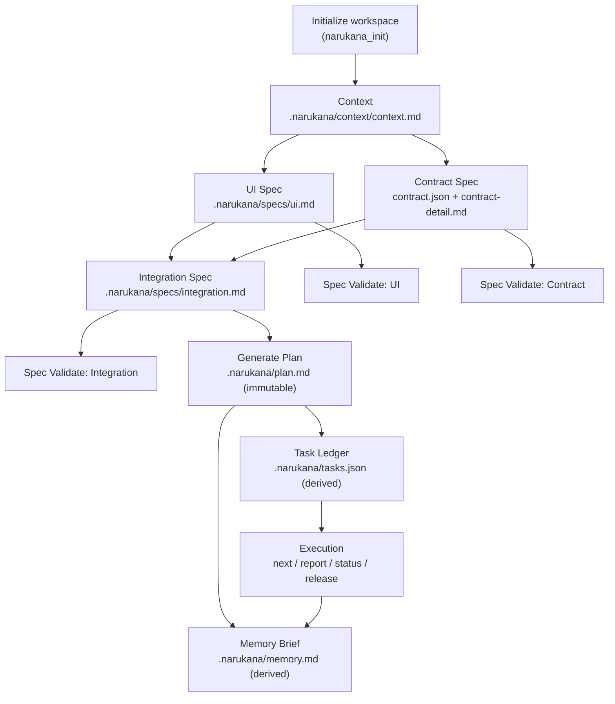

<p align="center">
  
</p>

<p align="center">
  
  
  
  
</p>

<p align="center">
  
</p>

# Narukana

Narukana is a standalone spec engine for OpenCode.

It exists to solve a common problem: teams and agents often start coding before the spec is stable. Narukana keeps work aligned by making specs the source of truth, generating an immutable plan from those specs, and coordinating execution through a derived task ledger.

> [!IMPORTANT]
> Narukana is its own product. This README does not position it as a migration or upgrade from any previous framework.

## What Narukana does

- Creates and manages a `.narukana/` workspace.
- Treats `.narukana/context/*` and `.narukana/specs/*` as editable source of truth.
- Generates `.narukana/plan.md` as a derived, immutable artifact.
- Generates `.narukana/tasks.json` from `plan.md` for execution coordination.
- Generates `.narukana/memory.md` as a derived brief for fresh agent sessions.
- Provides read-only validators for both spec quality and implementation evidence.

## Spec Engine Workflow



---

## Quick Start (OpenCode)

### 1) Install and build Narukana

From the Narukana repository root:

```bash
git clone https://github.com/Rezacrown/Narukana

cd Narukana

bun install
bun run build
```

This generates:

- `dist/index.js` (actual plugin runtime)
- `command/*.md` and `src/commands/*.md` (command wrapper docs)

### 2) Register Narukana plugin in OpenCode (Global or Project-only)

You can register Narukana in two ways:

- **Global config**: available in all projects
- **Project-only config**: available only in one repository

#### Option A: Global OpenCode config

Edit your global OpenCode config file (for example `~/.config/opencode/opencode.jsonc`) and add:

```jsonc
{
  "plugin": [["file:///ABSOLUTE/PATH/TO/Narukana/dist/index.js", {}]],
  "command": ["ABSOLUTE/PATH/TO/Narukana/command"],
}
```

#### Option B: Project-only OpenCode config

Create or edit `opencode.jsonc` in your project root:

```jsonc
{
  "plugin": [["file:///ABSOLUTE/PATH/TO/Narukana/dist/index.js", {}]],
  "command": ["ABSOLUTE/PATH/TO/Narukana/command"],
}
```

> [!NOTE]
> If your path contains spaces, encode them as `%20`.

Examples:

- macOS/Linux: `file:///home/username/projects/.opencode/dist/index.js`
- Windows: `file:///C:/Users/username/projects/.opencode/dist/index.js`

And for command wrappers directory:

- macOS/Linux: `/home/username/projects/.opencode/command`
- Windows: `C:/Users/username/projects/.opencode/command`

### 3) Make sure `/command` docs are discoverable

Narukana has two parts that must both be wired:

- **Plugin tools**: executable tools loaded from `dist/index.js`
- **Command wrappers**: markdown docs loaded from the `command` folder path in OpenCode config

To refresh command wrappers:

```bash
bun run build:command
```

What to verify:

1. `command/` contains files like `init.md`, `plan_create.md`, `execute_task.md`.
2. Your OpenCode config has `"command": [".../Narukana/command"]`.
3. OpenCode session is running in this repo/workspace.
4. Reopen or restart the OpenCode session after regenerating wrappers.

If `/command` docs still do not show:

1. Run `bun run build:command` again.
2. Confirm files exist in `command/`.
3. Confirm `command` path in global/project config points to Narukana `command` folder.
4. Restart OpenCode session for this workspace.

### 4) First practical flow

Run tools in this order:

1. `narukana_init`
2. `narukana_context_create`
3. `narukana_ui_spec_create`
4. `narukana_contract_spec_create`
5. `narukana_integration_spec_create`
6. `narukana_plan_create`
7. `narukana_execute_task` with `action: "next"`

---

## Using Narukana in other agents (Claude Code, Cursor)

Narukana's **workflow model** is agent-agnostic (spec files + plan + tasks). The current native runtime package in this repo is optimized for OpenCode, but you can still use Narukana in other agents with this setup:

### Claude Code

1. Clone Narukana and run `bun run build`.
2. Keep `.narukana/` in your project as the source of truth.
3. Use the generated docs in `command/*.md` as command references.
4. Run Narukana steps from your terminal (or scripts) and let Claude Code operate on the same repo files.

### Cursor

1. Open your project in Cursor.
2. Keep `.narukana/` files in the repo and edit specs there.
3. Use `command/*.md` as operational playbooks for your team/agents.
4. Trigger Narukana build/refresh from terminal (`bun run build`, `bun run build:command`) and continue coding in Cursor.

> [!NOTE]
> In this repository version, OpenCode has first-class plugin integration. Other agents can still follow the same Narukana spec engine workflow through the shared `.narukana/` artifacts and command wrapper docs.

---

## Command Guide (by context)

### A) Workspace Setup and Spec Authoring

| Command                            | Purpose                                                     | Typical use                                       |
| ---------------------------------- | ----------------------------------------------------------- | ------------------------------------------------- |
| `narukana_init`                    | Creates `.narukana/` structure and default files if missing | First setup in a repo                             |
| `narukana_context_create`          | Creates `context.md`                                        | Define goals, constraints, assumptions            |
| `narukana_ui_spec_create`          | Creates `ui.md`                                             | Define UI actions, states, and UI data            |
| `narukana_contract_spec_create`    | Creates `contract.json` and `contract-detail.md`            | Define backend/contract operations                |
| `narukana_integration_spec_create` | Creates `integration.md`                                    | Define mappings between UI actions and operations |
| `narukana_plan_create`             | Generates immutable `plan.md` from specs                    | Move from spec phase to execution phase           |

Flags used in this context:

- `regenerate` (boolean)
  - `false` (default): do not overwrite existing files.
  - `true`: overwrite and create backup `*.bak.<timestamp>`.
- `include` (string, `narukana_context_create` only)
  - Use provided text as the full `context.md` content.

### B) Task Execution and Coordination

| Command                 | Purpose                                                  | Typical use              |
| ----------------------- | -------------------------------------------------------- | ------------------------ |
| `narukana_execute_task` | Claim task, report progress, check status, release lease | Daily execution workflow |

Flags used in this context:

- `action` (required)
  - `next`: claim next eligible task.
  - `status`: show ledger summary.
  - `report`: update one task status.
  - `release`: release one claimed task.
- `name` (required for `next`, `report`, `release`): claimer identity (agent/person).
- `leaseMinutes` (optional, default `120`): claim duration.
- `taskId` (required for `report` and `release`): task ID like `T-001`.
- `status` (for `report`): `in_progress | done | failed | blocked`.
- `fatalReason` (optional): reason when reporting failure.
- `evidence` (optional): completion evidence.

Memory behavior in execution:

- `narukana_plan_create` writes both `.narukana/plan.md` and `.narukana/memory.md`.
- `narukana_execute_task` checks memory frontmatter `planId` against current plan hash.
- If memory is missing, stale, or invalid, Narukana auto-refreshes memory before continuing.
- Source of truth remains `.narukana/context/*`, `.narukana/specs/*`, `.narukana/plan.md`, and `.narukana/tasks.json`.

### C) Spec Validation (Read-only)

| Command                              | Purpose                                                 | Typical use                    |
| ------------------------------------ | ------------------------------------------------------- | ------------------------------ |
| `narukana_ui_spec_validate`          | Validates UI spec structure and required anchors        | After editing `ui.md`          |
| `narukana_contract_spec_validate`    | Validates `contract.json` and required operation fields | After editing `contract.json`  |
| `narukana_integration_spec_validate` | Validates required integration sections                 | After editing `integration.md` |

Flags used in this context:

- No special flags.

### D) Deep Validation and Sync

| Command                         | Purpose                                                       | Typical use                         |
| ------------------------------- | ------------------------------------------------------------- | ----------------------------------- |
| `narukana_ui_validate`          | Checks UI code evidence for declared UI actions               | Implementation audit                |
| `narukana_contract_validate`    | Checks backend/contract evidence for declared operations      | Implementation audit                |
| `narukana_integration_validate` | Verifies mapping consistency across specs and implementations | End-to-end consistency audit        |
| `narukana_sync`                 | Checks required files and suggests next validations           | Before plan generation or execution |

Flags used in this context:

- No special flags.

`narukana_sync` also reports whether `.narukana/memory.md` exists and whether it is in sync with current `plan.md`.

---

## Workspace layout

```text
.narukana/
  narukana.json
  context/
    context.md
    idea.md
  specs/
    ui.md
    contract.json
    contract-detail.md
    integration.md
  plan.md
  tasks.json
  memory.md
```

## Multi-agent consistency guidance

- Treat `memory.md` as a generated brief, not an editable requirements file.
- Fresh agents should quickly check memory first, then confirm plan/task IDs align.
- Never move source-of-truth decisions into memory; edit context/specs/plan/tasks instead.

## Development scripts

- `bun run typecheck`
- `bun run build`
- `bun run build:command`
