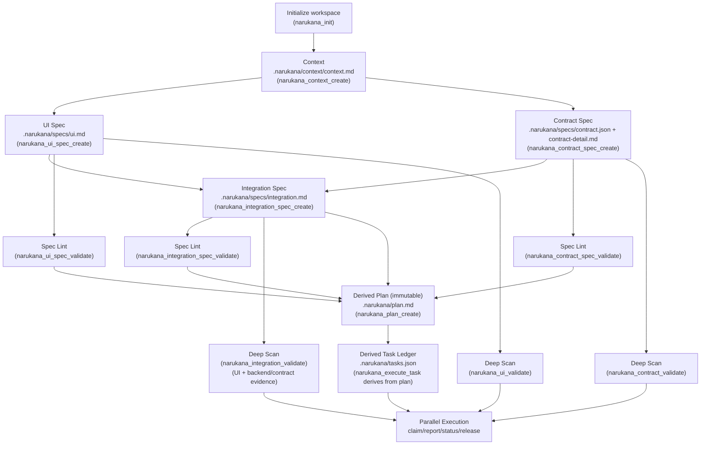

# NARUKANA — MASTER IMPLEMENTATION PLAN (narukana-plan)

> **Purpose**: This is the single, unambiguous execution plan to build **Narukana**, a minimal **Spec → Plan (immutable) → Tasks (derived)** engine for **personal DX** and **agentic development**, as an **OpenCode plugin**.
>
> This plan intentionally removes all legacy/extra framework behavior:
> - **No proposal engine** (no propose/apply, no pending/apply commands, no proposal storage).
> - **Idea is optional** (and lives under `.narukana/context/idea.md` if used).
> - **Manual editing is first-class** (users can edit spec files directly at any time).
>
> This document also contains the **fresh-session agent context** required to execute this plan without relying on prior chat history.

---

## 0) Fresh-session agent context (read this first)

### 0.1 What Narukana is (product definition)
Narukana is a **spec engine** (not a general development framework). It:

1) Maintains a project workspace under **`.narukana/`**.
2) Treats the **specs** in `.narukana/specs/` + `.narukana/context/` as the **source of truth**.
3) Produces a derived **immutable plan** at `.narukana/plan.md`.
4) Produces a derived **task ledger** at `.narukana/tasks.json` to coordinate execution across one or more agent instances.
5) Provides **read-only validators**:
   - **spec-lint** validators (structure/anchor checks)
   - **deep-scan** validators (implementation evidence checks)

Narukana is built as an **OpenCode plugin**, written in **TypeScript**, with **Bun** as the build/runtime toolchain.

### 0.2 Non-negotiables / invariants
These rules are absolute—do not deviate:

1) **No proposal system**
   - No `pending_get`, no `apply_pending`, no `*-apply` wrappers.
   - No `.narukana/review/proposals` or similar.
   - Tools write directly when they are *writers*.

2) **Plan is immutable**
   - `.narukana/plan.md` is always treated as a derived artifact.
   - Users do **not** manually edit plan. If spec changes, regenerate plan.

3) **Tasks are derived from plan**
   - `.narukana/tasks.json` is derived from `.narukana/plan.md`.
   - Only `tasks[].state.*` is mutable during execution.
   - If plan changes (planId hash changes), tasks.json must be regenerated.

4) **Validators are read-only**
   - Never write files.

5) **Direct manual editing is supported**
   - Users can manually edit `.narukana/context/*` and `.narukana/specs/*` at any time.

6) **Everything uses Bun**
   - `bun run build`, `bun run typecheck`.

### 0.3 Workflow flow diagram (for fresh agents)

This diagram is the canonical user workflow. Tools are modular, but this is the recommended happy path.



Key rules encoded by the diagram:
- Spec files are editable by the user at any time.
- Plan is regenerated from spec (immutable derived output).
- Tasks are regenerated from plan; only task state mutates.

### 0.4 Workspace layout (MUST match exactly)

Narukana uses `.narukana/` (NOT `.spec/`). The layout is:

```text
.narukana/
  narukana.json

  context/
    context.md
    idea.md                 # optional (if present)

  specs/
    ui.md
    contract.json
    contract-detail.md
    integration.md

  plan.md                   # derived, immutable
  tasks.json                # derived from plan, runtime coordination
```

### 0.4 Command semantics (MUST match exactly)

Narukana uses a **create + regenerate flag** pattern:

- Writers are named `*_create`.
- There are **no update tools**.
- To refresh a file, the user uses `regenerate: true` (or equivalent wrapper flag `--regenerate`).

Required writers (direct write):
- `narukana_context_create`
- `narukana_ui_spec_create`
- `narukana_contract_spec_create` (writes both `contract.json` and `contract-detail.md`)
- `narukana_integration_spec_create`
- `narukana_plan_create`

Execution coordination:
- `narukana_execute_task` (next/report/status/release)

Read-only:
- `narukana_sync`
- `narukana_*_spec_validate`
- `narukana_*_validate` (deep scan)

### 0.5 Overwrite policy (NO gray areas)

For every writer tool:
- If the target file exists and `regenerate !== true` → **DO NOT overwrite**. Return a clear message telling the user to run with `regenerate:true`.
- If `regenerate === true` → overwrite the target file.

Optional but recommended safety behavior:
- Before overwriting, create a backup copy next to the file as `filename.bak.<ISO_TIMESTAMP>`.
- This backup behavior must be consistent across all writer tools.

**Decision for this plan**: backups are **ENABLED**.

### 0.6 Existing project vs greenfield

- **Idea is optional.**
- Existing projects often start at `.narukana/context/context.md`.
- If `.narukana/context/idea.md` exists, `narukana_context_create` may use it as additional input.

There is **no mandatory flow**. However, plan generation (`narukana_plan_create`) requires:

Required inputs for plan:
- `.narukana/context/context.md`
- `.narukana/specs/ui.md`
- `.narukana/specs/contract.json`
- `.narukana/specs/integration.md`

If any required input is missing, `narukana_plan_create` must fail with a precise error listing missing paths.

---

## 1) Repo location and setup

### 1.1 Target directory
Narukana repository root MUST be:

`C:\Users\aryhi\Desktop\Projects\seinarukana framework\Narukana`

### 1.2 Minimal repo structure (code)

```text
Narukana/
  package.json
  tsconfig.json
  src/
    index.ts
    core/
      constants.ts
      fileSystem.ts
      hashing.ts
      config.ts
      planFormat.ts
    tools/
      init.ts
      contextCreate.ts
      uiSpecCreate.ts
      contractSpecCreate.ts
      integrationSpecCreate.ts
      planCreate.ts
      executeTask.ts
      sync.ts
      uiSpecValidate.ts
      contractSpecValidate.ts
      integrationSpecValidate.ts
      uiValidate.ts
      contractValidate.ts
      integrationValidate.ts
  src/commands/
    (wrapper md files)
  scripts/
    build-command-wrappers.ts
  command/
    (generated wrappers)
  dist/
    (build output)
  README.md
```

### 1.3 Build scripts (Bun-only)
`package.json` MUST include:

- `typecheck`: `bun x tsc -p tsconfig.json --noEmit`
- `build`: `bun run build:ts && bun run build:command`
- `build:ts`: `bun x tsc -p tsconfig.json`
- `build:command`: `bun run scripts/build-command-wrappers.ts`

No direct `tsc` invocations.

---

## 2) `.narukana/` workspace initialization

### 2.1 `narukana_init`

Narukana should support a minimal init that creates required directories and default files.

It must create:
- `.narukana/context/`
- `.narukana/specs/`

And default minimal files if missing:
- `.narukana/narukana.json` (user-owned config)
- `.narukana/context/context.md` (template)
- `.narukana/specs/ui.md` (template with anchored blocks)
- `.narukana/specs/contract.json` (template skeleton)
- `.narukana/specs/contract-detail.md` (template skeleton)
- `.narukana/specs/integration.md` (template skeleton)

It must NOT create:
- proposals folder
- scope.md

### 2.2 `narukana.json` format (MUST)

```json
{
  "schemaVersion": 1,
  "projectName": "",
  "paths": {
    "uiRoot": "",
    "contractRoot": ""
  }
}
```

---

## 3) Spec writers (direct write)

### 3.0 Templates & examples (NO ambiguity)

This section provides **exact example templates** for Web2 and Web3 so a fresh agent session can generate correct initial specs.

> Notes:
> - These are examples. The generator may add extra fields, but MUST preserve required headings/markers and MUST keep the core schema.
> - For Web2, `transport: "http"`.
> - For Web3, `transport: "contract"`.

#### 3.0.1 Example — `.narukana/context/context.md`

```md
# Context

## Goal
Describe the desired outcome in one paragraph.

## System Overview
- What is being built?
- Who are the users?
- Where does the UI run?
- Where does the backend/contract run?

## Constraints
- Tech stack constraints
- Deployment constraints
- Performance constraints
- Security constraints

## Assumptions
- Assumptions that, if wrong, would break the design

## Non-Goals
- Explicitly list what is NOT being built

## Risks
- Biggest risks and unknowns
```

#### 3.0.2 Example — `.narukana/specs/ui.md`

```md
# UI Spec

## Description
A short description of the UI and what it enables.

## Layout / Components
- List primary screens/components

## States
- loading
- empty
- error
- success

<!-- narukana-ui-actions -->
- action: Connect Wallet
- action: Mint NFT
- action: View Mint Status
<!-- /narukana-ui-actions -->

<!-- narukana-ui-data -->
- entity: MintReceipt
  fields:
    - txHash: string
    - status: pending | success | failed
<!-- /narukana-ui-data -->

## User Flow
1) User opens app
2) User triggers an action
3) UI calls an operation
4) UI updates state
```

#### 3.0.3 Example — Web2 `contract.json` + `contract-detail.md`

**`.narukana/specs/contract.json` (Web2 HTTP example)**

```json
{
  "schemaVersion": 1,
  "name": "Example API",
  "domain": "example",
  "operations": {
    "getProfile": {
      "type": "query",
      "domain": "profile",
      "transport": "http",
      "method": "GET",
      "endpoint": "/api/profile",
      "input": {
        "userId": "string"
      },
      "output": {
        "userId": "string",
        "name": "string",
        "avatarUrl": "string"
      }
    },
    "updateProfile": {
      "type": "mutation",
      "domain": "profile",
      "transport": "http",
      "method": "POST",
      "endpoint": "/api/profile/update",
      "input": {
        "userId": "string",
        "name": "string",
        "avatarUrl": "string"
      },
      "output": {
        "ok": "boolean"
      }
    }
  }
}
```

**`.narukana/specs/contract-detail.md` (Web2 example)**

```md
# Contract / API Details

> This file explains each operation from `contract.json` in human terms.

## Operation: getProfile
- Type: query
- Transport: http
- Method: GET
- Endpoint: /api/profile

### Purpose
Fetch a user's profile.

### Input
- userId (string)

### Output
- userId (string)
- name (string)
- avatarUrl (string)

### Errors
- 404: profile not found
- 500: internal error

### Notes
- Caching: allowed
```

#### 3.0.4 Example — Web3 `contract.json` + `contract-detail.md`

**`.narukana/specs/contract.json` (Web3 contract example)**

```json
{
  "schemaVersion": 1,
  "name": "Example NFT",
  "domain": "nft",
  "operations": {
    "mint": {
      "type": "mutation",
      "domain": "mint",
      "transport": "contract",
      "target": "0xYourContractAddress",
      "function": "mint",
      "input": {
        "to": "address",
        "quantity": "number"
      },
      "output": {
        "txHash": "string"
      }
    },
    "totalSupply": {
      "type": "query",
      "domain": "mint",
      "transport": "contract",
      "target": "0xYourContractAddress",
      "function": "totalSupply",
      "input": {},
      "output": {
        "total": "number"
      }
    }
  }
}
```

**`.narukana/specs/contract-detail.md` (Web3 example)**

```md
# Contract / API Details

## Contract: Example NFT
- Network: (fill)
- Address: 0xYourContractAddress

## Operation: mint
- Type: mutation
- Transport: contract
- Target: 0xYourContractAddress
- Function: mint

### Purpose
Mint NFTs to a recipient.

### Input
- to (address)
- quantity (number)

### Output
- txHash (string)

### Reverts / Errors
- NotEnoughValue
- MaxSupplyReached

### Notes
- Requires wallet connection
- Gas costs apply
```

#### 3.0.5 Example — `.narukana/specs/integration.md` mapping rules (Web2/Web3)

Integration spec MUST explicitly map UI actions to operations.
Use this canonical format (must be parseable):

```md
# Integration Flow

## Runtime Flow
UI action → operation call → response → UI state update

## Mappings
- action: Connect Wallet
  calls:
    - op: (none)   # purely local UI state
  success:
    - ui: walletConnected=true
  error:
    - ui: showError("Wallet connection failed")

- action: Mint NFT
  calls:
    - op: mint
  success:
    - ui: showTxHash
    - ui: refreshTotalSupply
  error:
    - ui: showError("Mint failed")

## Contract Operations
- mint
- totalSupply

## Error Handling
- Standardize error surface to user-friendly messages

## Observability
- Log errors with action + op + correlation id
```

> The generator MUST include `## Mappings` in the initial integration template.


### 3.1 `narukana_context_create`

**Writes:** `.narukana/context/context.md`

Args:
- `regenerate: boolean = false`
- `include: string | undefined` (optional manual context content)

Behavior:
1) Ensure `.narukana/context/` exists.
2) If file exists and `regenerate=false` → refuse.
3) Determine content source:
   - If `include` is provided and non-empty → use it as the full content.
   - Else if `.narukana/context/idea.md` exists → derive a context template using idea.md as input.
   - Else → write a minimal context template asking the user to fill it.
4) Write context.md.

Context template MUST include headings:
- `# Context`
- `## Goal`
- `## System Overview`
- `## Constraints`
- `## Assumptions`
- `## Non-Goals`
- `## Risks`

### 3.2 `narukana_ui_spec_create`

**Writes:** `.narukana/specs/ui.md`

Args:
- `regenerate: boolean = false`

Behavior:
1) Ensure `.narukana/specs/` exists.
2) If file exists and `regenerate=false` → refuse.
3) Write a UI spec template.

UI spec MUST contain anchored block markers (exact strings):
- `<!-- narukana-ui-actions -->`
- `<!-- /narukana-ui-actions -->`
- `<!-- narukana-ui-data -->`
- `<!-- /narukana-ui-data -->`

Within the actions block, the action list format MUST be:
- `- action: <string>`

### 3.3 `narukana_contract_spec_create`

**Writes:**
- `.narukana/specs/contract.json`
- `.narukana/specs/contract-detail.md`

Args:
- `regenerate: boolean = false`

Behavior:
1) Ensure `.narukana/specs/` exists.
2) If either target file exists and `regenerate=false` → refuse (list which exists).
3) Create `contract.json` with schemaVersion=1 and operations object.
4) Create `contract-detail.md` that documents each operation in `contract.json`.

Contract JSON schema (minimum required fields per operation):
- `type` ("query" | "mutation" | "event" | "job" etc — allow string)
- `domain` (string)
- `transport` ("http" | "contract")
- `input` (object)
- `output` (object)

If transport=http, include:
- `method`
- `endpoint`

If transport=contract, include:
- `target`
- `function`

### 3.4 `narukana_integration_spec_create`

**Writes:** `.narukana/specs/integration.md`

Args:
- `regenerate: boolean = false`

Behavior:
1) Ensure `.narukana/specs/` exists.
2) If file exists and `regenerate=false` → refuse.
3) Integration template MUST include:
   - `# Integration Flow`
   - `## Runtime Flow`
   - `## UI Actions`
   - `## Contract Operations`
   - `## Error Handling`
   - `## Observability`

---

## 4) Plan generation (immutable)

### 4.1 `narukana_plan_create`

**Writes:** `.narukana/plan.md`

Args:
- `regenerate: boolean = true` (plan is derived; overwrite is allowed by default)

Required inputs:
- `.narukana/context/context.md`
- `.narukana/specs/ui.md`
- `.narukana/specs/contract.json`
- `.narukana/specs/integration.md`

Behavior:
1) Refuse if any required input is missing; list missing paths.
2) Parse UI actions from the anchored actions block.
3) Parse contract operations from contract.json.
4) Produce tasks as strict derived output.

Plan tasks format MUST be exactly:

- Task header:
  - `### T-001: <Title>`
- Followed by:
  - `DependsOn: <comma-separated T-IDs or empty>`
  - `SpecRefs: <comma-separated spec references or empty>`
  - `RiskTags: <comma-separated tags or empty>`
- Then blocks:
  - `Acceptance:` list with `- ...`
  - `Verification:` list with `- ...`

A final integration task MUST depend on all previous tasks.

---

## 5) Tasks ledger + executor

### 5.1 `narukana_execute_task`

**Reads:** `.narukana/plan.md`

**Creates/Updates:** `.narukana/tasks.json`

Args:
- `action: "next" | "report" | "status" | "release"`
- `name: string` (required for next/report/release)
- `leaseMinutes: number = 120`
- `taskId: string` (for report)
- `status: "in_progress" | "done" | "failed" | "blocked"` (for report)
- `fatalReason?: string`
- `evidence?: string`

Rules:
- `tasks.json` is derived from `plan.md`.
- A task is eligible if:
  - state.status == "todo"
  - all dependencies are done or skipped
- Claims expire by lease.
- If a task is reported `failed` with `fatalReason`, dependents become blocked.

Task file schema MUST match v1 schema used in Seinarukana executor (meta.planId hash + tasks[].definition + tasks[].state).

---

## 6) Validators

### 6.1 Spec-lint validators (read-only)
- `narukana_ui_spec_validate`
  - checks title and anchored blocks exist
  - warns on empty action list

- `narukana_contract_spec_validate`
  - validates contract.json parseable
  - requires operations object

- `narukana_integration_spec_validate`
  - validates required headings exist
  - warns if operations not referenced

### 6.2 Deep-scan validators (read-only)
- `narukana_ui_validate`
  - uses narukana.json.paths.uiRoot
  - scans source files for evidence of each UI action

- `narukana_contract_validate`
  - uses narukana.json.paths.contractRoot
  - scans for evidence of each operation

- `narukana_integration_validate`
  - uses narukana.json.paths.uiRoot and narukana.json.paths.contractRoot
  - validates that `.narukana/specs/integration.md` is consistent with BOTH implementations:
    1) UI codebase (UI action handlers exist AND reference the intended operations)
    2) Backend/contract codebase (the referenced operations exist with evidence)
  - minimum checks (must all run):
    - Parse UI actions from `.narukana/specs/ui.md` anchored actions block
    - Parse operations from `.narukana/specs/contract.json`
    - Parse the declared wiring/mapping in `.narukana/specs/integration.md`
    - Verify each mapping has evidence in UI code AND evidence in backend/contract code
  - report MUST list, separately:
    - missing mappings in integration.md
    - mappings with no UI evidence
    - mappings with no backend/contract evidence
    - operations defined but unused
    - UI actions defined but unmapped

---

## 7) Sync tool (read-only)

`narukana_sync` must:
- Verify presence of required inputs up to plan:
  - `.narukana/context/context.md`
  - `.narukana/specs/ui.md`
  - `.narukana/specs/contract.json`
  - `.narukana/specs/integration.md`
  - `.narukana/plan.md`
- Print recommended validators.
- Not modify any files.

---

## 8) Wrapper commands

Narukana will ship wrappers in `src/commands/*.md` and generate them into `command/`.

There MUST be wrappers for:
- init
- context_create
- ui_spec_create
- contract_spec_create
- integration_spec_create
- plan_create
- sync
- all validators
- execute_task

There MUST NOT be wrappers for:
- pending/apply proposals (they do not exist)

---

## 9) Verification checklist (must pass before completion)

1) `bun run typecheck` passes.
2) `bun run build` passes.
3) Running init + create tools produces correct `.narukana/` layout.
4) `narukana_plan_create` produces tasks with correct format.
5) `narukana_execute_task(action:"next")` creates `.narukana/tasks.json` and claims a task.
6) Validators return reports without writing files.

---

## 10) Implementation order (exact)

1) Bootstrap Narukana repo (package.json, tsconfig, src skeleton).
2) Implement core constants + filesystem helpers.
3) Implement `narukana_init`.
4) Implement `narukana_context_create`.
5) Implement `narukana_ui_spec_create`.
6) Implement `narukana_contract_spec_create` (json + detail md).
7) Implement `narukana_integration_spec_create`.
8) Implement `narukana_plan_create`.
9) Implement `narukana_execute_task`.
10) Implement spec-lint validators.
11) Implement deep-scan validators.
12) Implement `narukana_sync`.
13) Add wrappers + README.
14) Final verification checklist.
